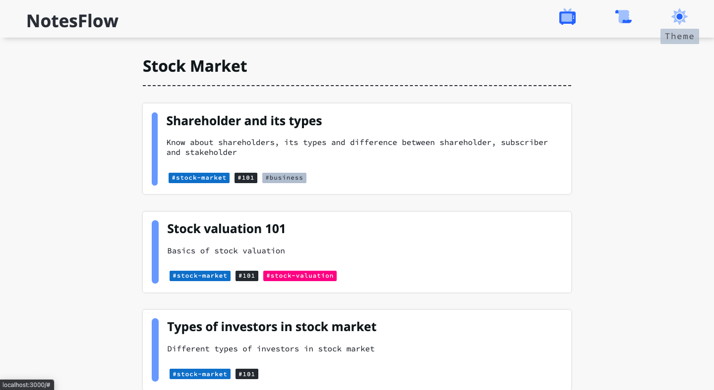
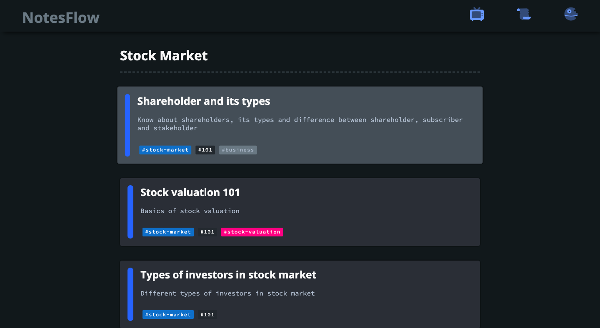
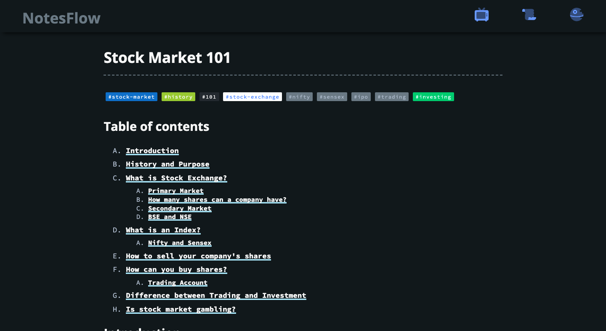
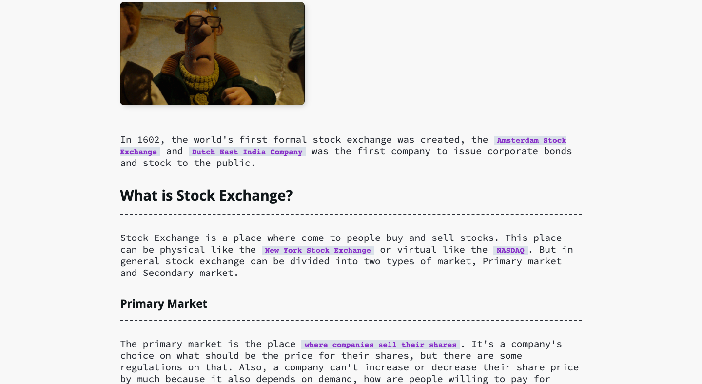

# notesflow

Web app to make and store notes easy and organised.

## Table of contents

- [To Do](#to-do)
- [Content writing info](#content-writing-info)
- [Images of the app](#images-of-the-app)
- [License](#license)

## To Do

- Make the app responsive
- Be able to write and add content
- Display metadata about content in individual content page
- Display content under a specific tag
- Display all the content (sorted by last modified datetime)
- Add text serching feature
- Convert text to audio in realtime

## Content writing info

All of these contents are written inside `markdown` files.

When you are writing content inside markdown file, add metadata. Example is below.

```markdown
---
title: Stock valuation 101
description: Basics of stock valuation
tags:
  - stock-market
  - 101
  - stock-valuation
lastmod: 2021-04-24T13:41:06-05:00
publishdate: 2021-04-24T13:41:06-05:00
coverImageUrl: ""
coverGifUrl: ""
---
```

**Note**: The `coverImageUrl` and `covergifUrl` can be empty string as show in the above example.

Also, after the content metadata write `## Table of contents` if you want table of content for the individual post. If you are writting `## Table of contents` line then after that start writing about the content by giving heading so that the content below `## Table of contents` doesn't get erased by the `remark-toc` plugin (used for generating table of content). Example if below.

```
---
title: Stock valuation 101
description: Basics of stock valuation
tags:
  - stock-market
  - 101
  - stock-valuation
lastmod: 2021-04-24T13:41:06-05:00
publishdate: 2021-04-24T13:41:06-05:00
coverImageUrl: ""
coverGifUrl: ""
---

## Table of contents

## Introduction

---

Valuation is the analytical process of determining the current (or projected) `worth of an asset of a company`. There are many techniques used for doing a valuation. An analyst placing a value on a company looks at the `business's management`, the composition of its `capital structure`, the prospect of `future earnings`, and the `market value of its assets` and among other metrics.
```

Another important thing to note is `remark-toc` add `<ul>` (table of content) below `## Table of content`, so for styling this table of content `.react-markdown-content ul` is used, because of this all the `ul (list)` inside the markdown file gets affted. This is taken care by wrapping the `lists` inside the a `blockquote` and then `overwritting its style`. Example is below.

```markdown
<!-- If writting list then write it this way -->

> - To safeguard the interest of the investors.
> - Ensure the Indian capital market is transparent to its investors.
> - The capital market function in a systematic manner.

<!-- And not like this (because by doing so, the styling for table of content will be applied on this list) -->

- To safeguard the interest of the investors.
- Ensure the Indian capital market is transparent to its investors.
- The capital market function in a systematic manner.
```

Another implementation (writting content) detail, for example write `**Example**` as heading and after every heading add `---` line below. Examples are below.

```markdown
<!-- **Example** as heading example -->

`Relative valuation` models, in contrast, operate by comparing the company in question to other similar companies. These methods involve calculating multiples and ratios, such as the `price-to-earnings multiple`, and comparing them to the multiples of similar companies.

**Example**

For example, if the P/E of a company is lower than the P/E multiple of a comparable company, the original company might be considered undervalued. Typically, the relative valuation model is a lot easier and quicker to calculate than the absolute valuation model, which is why many investors and analysts begin their analysis with this model.

<!-- Heading example -->

## The Two Main Categories of Valuation Methods

---
```

## Images of the app






## License

[MIT](./LICENSE)
